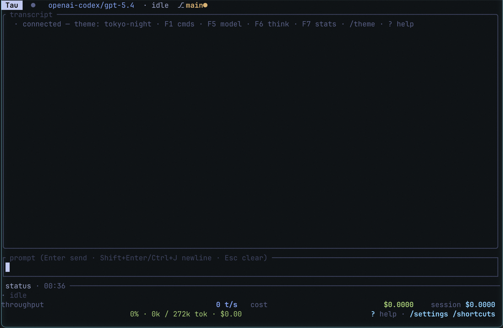

# Tau (2*PI)

**A fast, keyboard-first terminal UI for the
[Pi coding agent](https://github.com/mariozechner/pi-coding-agent).**

Stream model output, approve plans before they run, browse tool calls, run
git from the composer, and reuse prompt templates — all without leaving
the terminal.

> **Note:** The underlying Rust project and repository remain named `rata-pi`, but the resulting binary and user-facing application is **Tau**.



```text
  ┌ Tau ● claude-sonnet-4-6 · llm · ⎇ main ● t3 ──────────────────┐
  │ you                                                           │
  │   refactor the settings reducer — keep the RPC fanout intact  │
  │                                                               │
  │ thinking                                                      │
  │   let me read mod.rs around the cycle rows first…             │
  │                                                               │
  │ 🛠 Read src/app/mod.rs (lines 1240–1320)                       │
  │ 🛠 Edit src/app/modals/settings.rs                             │
  │                                                               │
  │ ┌ plan · review ────────────────────────────────────────────┐ │
  │ │ [ ] extract cycle dispatch into its own fn                │ │
  │ │ [ ] rewire theme row to the new dispatcher                │ │
  │ │ [ ] update snapshot tests                                 │ │
  │ │                                                           │ │
  │ │  [ Accept (a) ]  [ Edit (e) ]  [ Deny (d) ]   auto-run ✓  │ │
  │ └───────────────────────────────────────────────────────────┘ │
  │                                                               │
  │ > _                                                           │
  ├───────────────────────────────────────────────────────────────┤
  │ ctx 14.2k/200k ▇▁ $0.014  ?  · /settings · /shortcuts         │
  └───────────────────────────────────────────────────────────────┘
```

## Status

**`v1.0.0`** — first tagged release. See
[`CHANGELOG.md`](CHANGELOG.md) for the full feature list,
[`docs/USER_GUIDE.md`](docs/USER_GUIDE.md) for the user manual,
[`docs/FEATURES.md`](docs/FEATURES.md) for the illustrated tour,
[`docs/PITCH.md`](docs/PITCH.md) for the short elevator pitch, and
[`docs/ANNOUNCEMENT.md`](docs/ANNOUNCEMENT.md) for the `1.0.0`
announcement.

## Who it's for

- You already drive Pi from the CLI and want a chat surface that
  doesn't lose your place on long sessions.
- You want the agent to propose multi-step plans, but nothing runs
  until you've seen the list.
- You live in tmux / kitty / WezTerm / Ghostty and don't want to
  leave the terminal for an Electron UI.
- You want settings, shortcuts, git, file-finder, transcript search,
  and templates all behind a single keystroke.

## Features at a glance

- **Streaming transcript** — per-entry render/height cache, live tail
  pin, focus mode (`Ctrl+F`) for card-level nav, markdown + syntect
  fenced-code highlighting that tracks the active theme.
- **Plan approval flow** — when the agent emits
  `[[PLAN_SET: …]]`, Tau opens a review modal. You Accept, Edit
  (add / delete / in-place edit steps), or Deny. Accepted plans
  auto-run if you left the toggle on.
- **Agent interview forms** — `[[ASK_TEXT: …]]`-style markers pop a
  structured form with Tab navigation and `Ctrl+Enter` submit. Tau
  returns a single JSON block so the agent parses deterministically.
- **Slash picker** — `/` or `F1` opens a fuzzy palette over built-ins
  + pi skills / prompts / extensions.
- **`/settings`** — every runtime tunable plus live state (model,
  thinking level, steering + follow-up mode, auto-compact, auto-retry,
  notifications, vim mode, theme, raw-marker visibility, focus marker).
- **`/shortcuts`** — read-only keybinding reference grouped by context.
- **Transcript search** (`/search`) — live overlay with per-hit
  snippets; `n` / `N` to walk hits, `Enter` focuses the match.
- **Composer templates** (`/template`) — save a prompt, load it into
  the composer, delete it from a two-pane picker.
- **Git integration** — `/status`, `/diff`, `/log`, `/branch`,
  `/commit`, `/stash`, in-app diff viewer.
- **File finder** — `Ctrl+P` or `@path` in the composer; bounded
  previews with per-theme syntect highlighting.
- **Mouse** — click modal rows, click Plan Review chips, click outside
  any modal to close it, wheel scrolls into the focused modal.
- **Seven themes** — `tokyo-night` (default), `dracula`,
  `solarized-dark`, `catppuccin-mocha`, `gruvbox-dark`, `nord`,
  `high-contrast` (for CVD-friendly / low-color terminals).
- **Undo / redo in the composer** — `Ctrl+Z` / `Ctrl+Shift+Z`,
  64-snapshot ring. Draft auto-saved on quit, restored on next launch.
- **Preferences persistence** — theme, notifications, vim, thinking
  visibility, raw-marker visibility, and focus-marker style persist to
  `<config_dir>/tau/config.json`.
- **Notifications** — OSC 777 always on; `notify-rust` native desktop
  notifications behind the `notify` feature flag.
- **Resilience** — per-call RPC timeouts (bootstrap 3 s, stats 1 s,
  user actions 10 s), terminal panic hook with crash dump persisted
  to the platform state dir, graceful shutdown of the pi child.

## Install

### Homebrew (macOS, Linux)

```bash
brew install TheSamLePirate/rata-pi/rata-pi
```

*(tap repo is populated once the `v1.0.0` GitHub release is published
and the SHA256 fields in [`Formula/rata-pi.rb`](Formula/rata-pi.rb)
have been filled in.)*

### cargo install

```bash
cargo install rata-pi
```

### Build from source

```bash
git clone https://github.com/TheSamLePirate/rata-pi
cd rata-pi
cargo build --release   # target/release/tau, ~5 MiB
cargo run --release     # run without installing
```

### Prebuilt binaries

Every `v*` tag triggers a
[release workflow](.github/workflows/release.yml) that builds:

- macOS arm64 (`aarch64-apple-darwin`)
- macOS x86_64 (`x86_64-apple-darwin`)
- Linux x86_64 (`x86_64-unknown-linux-gnu`)
- Windows x86_64 (`x86_64-pc-windows-msvc`)

Download the tarball / zip for your platform from the
[Releases page](https://github.com/TheSamLePirate/rata-pi/releases).

## Running

```bash
tau                        # uses `pi` from $PATH
tau --pi-bin /path/to/pi   # explicit path
```

If `pi` isn't available the app still starts in **offline mode**: the
transcript shows the spawn error, but all local-only surfaces
(`/settings`, `/shortcuts`, `/themes`, git commands, file finder)
still work. Any RPC-backed toggle flashes a warning that the change
won't persist past this session.

### pi dependency

Install pi via npm:

```bash
npm install -g @mariozechner/pi-coding-agent
```

## Development

```bash
cargo build                   # debug
cargo build --release         # LTO + opt-level=3, ~5 MiB binary
cargo test --locked --all-features --all-targets
cargo clippy --all-features --all-targets -- -D warnings
cargo fmt -- --check
```

Rust edition `2024`. Project layout under `src/app/` is split across
focused modules: `mod` (state + dispatch + `draw_modal`), `draw`
(chrome), `visuals` (per-entry render cache), `events` (reducer over
`Incoming` events), `input` (global key handling), `cards`
(transcript card bodies), `modal_keys` (per-modal key dispatcher),
`modals/{bodies, interview, settings}`, and `helpers` for cross-cutting
utilities.

## Docs

- [`CHANGELOG.md`](CHANGELOG.md) — user-facing release notes.
- [`docs/USER_GUIDE.md`](docs/USER_GUIDE.md) — every feature with
  keybindings, settings, plan / interview flows, and troubleshooting.
- [`docs/FEATURES.md`](docs/FEATURES.md) — illustrated feature tour
  with ASCII mockups of each modal and flow.
- [`docs/PITCH.md`](docs/PITCH.md) — one-page elevator pitch.
- [`docs/ANNOUNCEMENT.md`](docs/ANNOUNCEMENT.md) — `v1.0.0`
  announcement post.
- [`PLAN_V3.md`](PLAN_V3.md) / [`PLAN_V4.md`](PLAN_V4.md) — master
  plans, design decisions, sub-milestone structure.
- [`track_v3_progression.md`](track_v3_progression.md) /
  [`track_v4_progression.md`](track_v4_progression.md) — live
  progression trackers with commit hashes, rolling metrics, and
  deviations.
- [`pi-doc.md`](pi-doc.md) — pointers into the pi coding agent source
  and docs used while building Tau.

## License

Copyright (c) olivvein <parcouru_epoque.9b@icloud.com>

Licensed under the MIT license ([LICENSE](./LICENSE) or
<http://opensource.org/licenses/MIT>).
